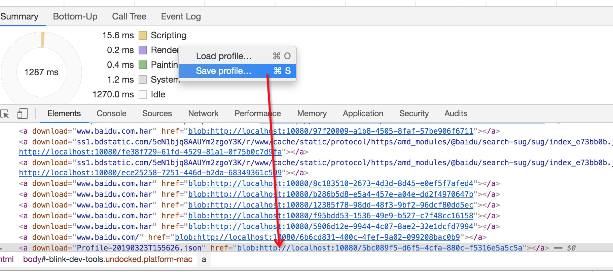

### dev-tool中资源单机右键save浏览器做了什么？

首先罗列一下浏览器有哪些保存到本地的行为

	network ->  save as ... [1]
			 -> Save all as HAR with content [2]
   memory -> heap snapshots -> item (save) [3]
   

行为触发以后的方法调用 host/InspectorFrontendHost.js （url作为以下的唯一Map标识）

	1、save方法将内容放到_urlsBeingSaved的map中，set(url, buffer),其中上面的[1],[3]直接将url和内容放入到buffer中，然后调用SavedURL 然后调用3
	2、append 放入内容分段append到buffer中，上面的[2]会这没用
	3、close 从_urlsBeingSaved 读出buffer，然后删除_urlsBeingSaved中的映射，在内存中新建a标签，用Blob每次生成一个唯一的id（就算相同的下载每次都生成一个唯一的标识），将a的href = URL.createObjectURL(blob);触发a的click 下载就弹出来了（但这里有一个坑就是URL.createObjectURL每次创建的内存默认不会被释放，因此如果找个资源大的视频网站一直执行[2]多次save as 内存就飙升了）

			  