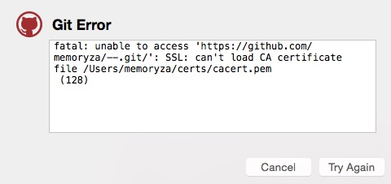

#mac_os_x更新yosemite以后github客户端更新提示ca认证错误解决办法

-------
   最近手贱更新了mac os yosemite的系统版本，更新以后发现部分软件无法使用，例如php 扩展的redis模块，mou，eclipse等等，甚是郁闷啊。对于图形化的软件还好说去官网更新一下新版本，但对于服务类的真是让人头疼，赶巧今天用github客户端更新代码的时候提示
   
   
   
   看起来好熟ca证书加载失败，因为github是基于https的，没有ca证书没办法做提交、更新等操作。电脑上刚安装github的时候特意搞过，但是升完级为什么就没有了呢，命令行切换到存放证书的目录
  
       cd ~/certs && ls
       cacert.pem.bak.pem
  我靠我的cacert.pem竟然bak完毕以后，出现了这样的问题，我估计是系统升级的时候做了bak，然后就这样了。只要将这个文件名字改回cacert.pem  github客户端就能用了
  
  
  （注：没有这个文件的，请点<a href="http://curl.haxx.se/docs/caextract.html">这里</a>），然后下载cacert.pem  放到用户目录下的certs就好了