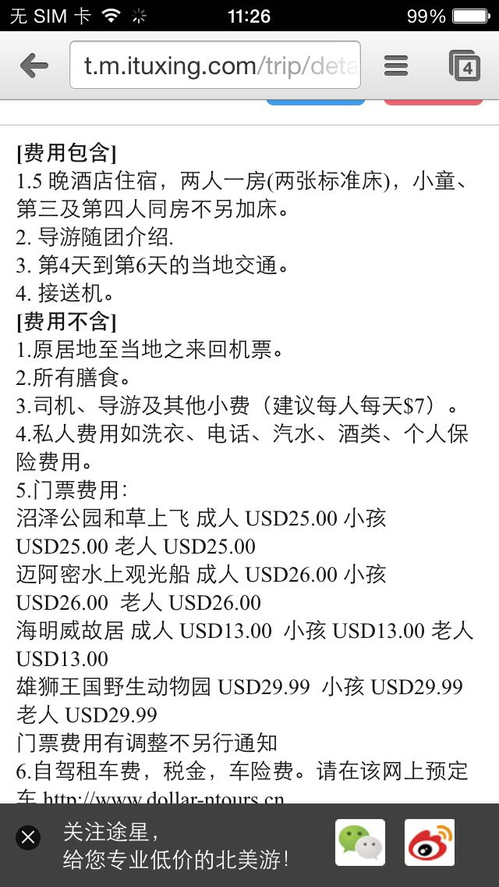
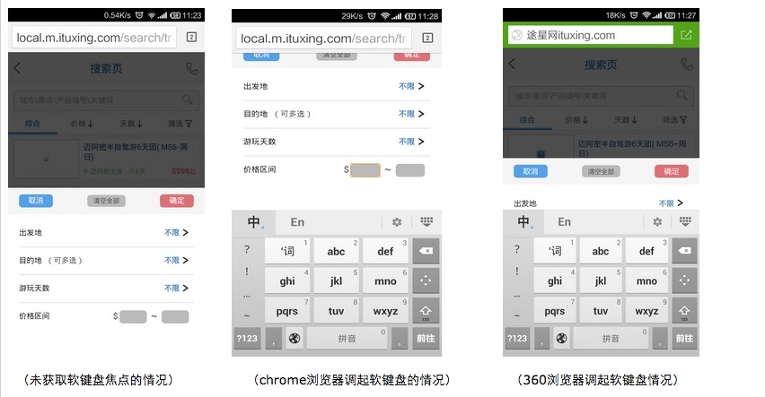
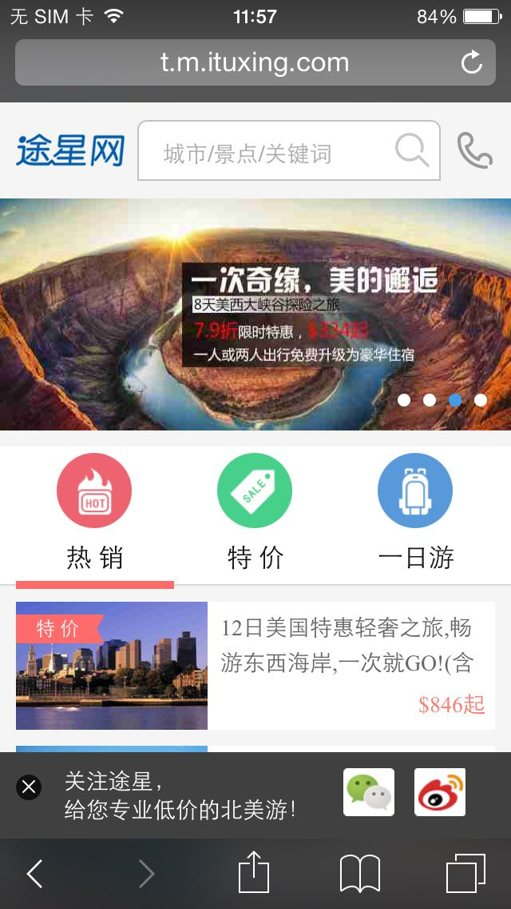
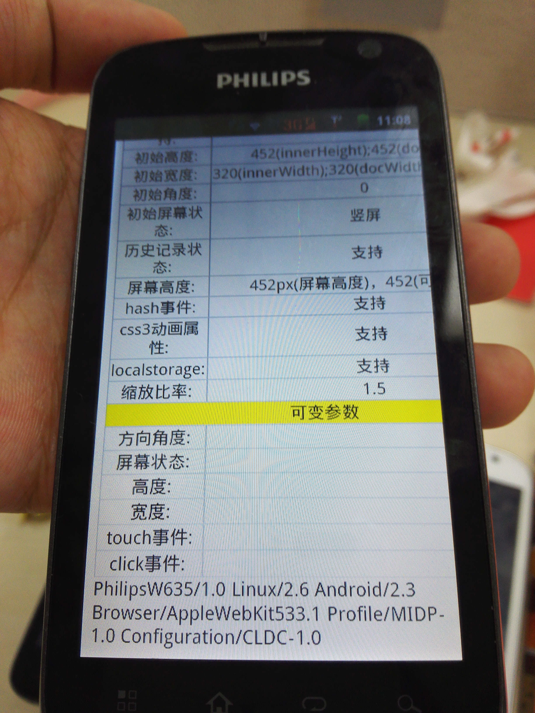

网站移动版本开发踩坑实五

1、chrome 地址栏自动隐藏交互行为对于fixed 顶部的元素遮挡

	系统：ios8.1
	浏览器：chrome 26.0.1410.53

     描述信息：页面包含fixed顶部的tip element，当页面向下滑动的时候chrome地址栏自动隐藏，当向上滑动的时候地址栏自动出现。这种交互行为本身的好处会增大用户可视、交互区域。但是在chrome 26这个版本貌似这个浏览器UI布局使用adjustPan的方式，以至于向上滑动以后fixed的元素没有被自动向下移动（没有重绘）。

<a href="https://code.google.com/p/chromium/issues/detail?id=288747">bug fixed</a>
<a href="http://stackoverflow.com/questions/11258877/fixed-element-disappears-in-chrome">解决办法在这里</a>

2、360浏览器文本框获得焦点后被软键盘遮罩的问题

     系统：android4.4
     浏览器：360浏览器6.6.7

   场景是这样的，站点上筛选按钮点击后弹出层（fixed），当输入框获取焦点以后弹出系统自带的软键盘，在android上十款浏览器挨个测试比对，发现在360浏览器弹出键盘以后获取焦点的文本框被软键盘覆盖了。截图如下
    

    
  那么问题来了，浏览器的软键盘显示出来又哪几种情况呢？英文   中文（网上找的）

  经过简单的了解，大概分析了一下软键盘在浏览器上弹出应该包含软键盘占用主activity空间，让主activity重新布局 和 不调整窗口大小浮在上面  这两种方式（哈哈这是我yy的）,360应该是使用后者，其他的也许是使用前者。

 

   既然问题出现了，那就要想办法解决，于是经过简单的推敲，基本上可以得出（存在不占用主窗口空间的软键盘技术） 1、当input获取焦点的时候，2、软键盘会弹出，3、fixed的层需要向上移动一下，4、成功输入；5、当input blur或是键盘点击回车以后,fixed还原位置（这里要庆幸360没有默认带旋转屏幕跟随转动，不然还要麻烦一点）

 

既然分析完毕就要写代码了

 1.添加识别浏览器代码

var isSpecialBrowser = navigator.userAgent.match(/360 Aphone.*\(([\d.]+)\)$/i)//360等部分软键盘采用的是软键盘不占用主窗口空间造成，吸底的 input获取焦点的时候被遮罩
2.处理事件

	$(document)
    .on('keydown keyup', Element,function(ev) {
            if(code == 13 && isSpecialBrowser) {
                    DOM.css('bottom', -310);
                }
            }
           
        })
        .on('focus', Element,function() {
            if(isSpecialBrowser) {
               DOM.css('bottom', -110);
            }
        })
        .on('blur', Element,function() {
            if(isSpecialBrowser) {
                DOM.css('bottom', -310);
            }
        });
　　

好了，问题解决了

但是会又问题，就是主动点击键盘收起按钮时没办法获取任何keycode和对应的事件，因此这里会有问题。

3、android 4.0.X版本 touchend 不触发（补充）

 这个bug是早期遇到的，看到代码的时候想来这个bug忘记记录了。问题发生在android4.0.x的版本，不会触发。<a href="https://code.google.com/p/android/issues/detail?id=19827">bug在这里</a>
 解决办法可以通过touchmove触发以后做一个定时器，检测200ms以后手动触发touchend事件
 
 4、ios safari  支持localstorage但是setItem异常（QUOTA_EXCEEDED_ERR:DOM Exception 22）
 
      平台：ios8.1
      browser：safari600.1.4
 
 问题源自于项目需要在浏览器中遮罩提示如图：
  

在safari下测试不通过，然后通过代码捕获到竟然报错了，可是你明明告诉我你支持啊。哈哈哈。没办法了只能通过检测手段fixed了， <a href="http://stackoverflow.com/questions/14555347/html5-localstorage-error-with-safari-quota-exceeded-err-dom-exception-22-an">bug issue</a>
索性我存储的只是一个状态，直接放在cookie里进行检测。后来我发现这个问题在taobao也没处理，应该是没注意到。

5、philipsw635手机自带浏览器media-query查询的min-height不稳定

   这个问题说起来有点逗，为了兼容屏幕过小的手机，我们使用了media-query做了一些特殊处理，统一一款浏览器刷新三显示出来两种效果，一种效果是大屏手机应该有的，一种是针对小瓶幕的，结果查了一下屏幕信息竟然动态输出两种不同的高度信息，屏幕中的屏幕高度一次是179px，一次是452px，呵呵我也是笑了。针对于这种情况既然信息不一样那就让起展现不一样，不影响体验即可。
   
   
   
   
6、滚动到页面顶部用$('body').scrollTop(0)不要用window，在safari下滚动容易失效

7、 三星s3 系统版本4.0.4字体不支持加粗

这个手机好神奇啊，用css或是html标签设置加粗样式均失效,设置为自带字体也不行，
ua信息如下Mozilla/5.0 (Linux; U; Android 4.0.4; zh-cn; GT-I9300 Build/IMM76D) AppleWebKit/534.30 (KHTML, like Gecko) Version/4.0 Mobile Safari/534.30
 
8、 philips wo3G手机 pushstate问题

 调用方法history.pushstate(state, title, url)
手机是问题5的那个手机，自带浏览器，pushstate检测可用，并且调用后地址栏中的地址确实变更了，但是location.href竟然没变，临时想了一个解决方法，调用完毕pushstate后用正则匹配location.href 和 url确认一下是否可用（后来检测到history.state也无法变更，当然可以用state检测pushstate是否好使，毕竟state也是跟pushstate一批提出来的属性，所以我没有采用他，防止采坑）。

9、部分android机型，例如三星-sm-a3009出现页面手气键盘后，整体页面下沉
   键盘呼起方式adjustResize，键盘呼起前页面没有滚动条，页面呼起后页面重置大小，页面产生滚动条，然后向下滚动，输入文本提交，反复这样几次，页面整体下沉，这个时候发现页面body距视窗和文档的位置依旧为0
  
   
   想到一个处理办法：当判断是固定机型让body，fixed就不会收到滚动条出现影响。经过验证问题解决
