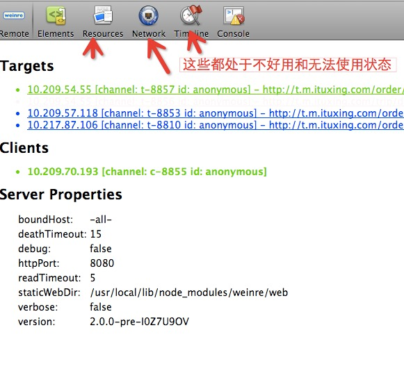

#网站移动网页版本开发调试锦囊

   
   呵呵说这个题目有点玄啊，趁闲下来的时候将我以前用过各种移动开发调试工具及办法列出来方便大家一起婉转移动网页版本开发（以下统称为m版本开发）。
   以来列举各种办法各有优略，各有益处，不分先后，大概说一说
   
   1. chrome等自带的模拟器
   
   记不得chrome从那个版本开始包含手机模拟器了，这对于进入网页版本开发简直就是降低了一个门槛，开发带了了极大的遍历，其中新版本更新以后包含网络状态模拟、设备选择、ua，方便开发和调试（只能说很好很强大，我是一个chrome重度用户），虽然chrome带来了如此之多的开发遍历，也依旧有不足，chrome在切换手机模拟状态以后事件上做了兼容的，但是对于实际设备上的真实情况模拟指定是做不到的，因为用户手机上的浏览器五花八门，版本不一。chrome只是能快速的帮你做第一步验证和杜绝绝大部门容易产生的错误。
       
   
   2. <a href="https://gist.github.com/addyosmani/fd3999ea7fce242756b1">css-debugger</a>
   
   这是一个通过在所有页面元素添加outline的方式，绘制出当前页面元素的盒子容器的大小，他的益处就是够小，只需要短短108个字节（看下面的回复会有更精悍的代码）就可以将页面dom占用大小一览无余，对于页面构建的同学有帮助，但是只适合调整页面，没有图形化操作工具，入门级布局可以试着使用和跟踪调试你的布局。
    
    
   
   3. chrome、safari等利用手机连接usb进行本地调试
      
   	 这种方式需要开启设备上的safari、chrome的支持调试的功能，并连接到电脑，对应的开启电脑版本的浏览器调试。它的弊端很明显，就是单一浏览器只能调试自己的对应的浏览器，并且设备需要连接电脑（yy一下你有n多设备，不可能每一台都拿来自己调试吧？），以下适宜下safari的调试截图
   	 
   	 
   	      
   	 
   4. adb调试
   
      这个工具是最早的调试方式，笔者曾经废了半天的力气将调试环境搭建好了（自行寻找相关的文章太多了），但是第二次再也没碰它，问题很明显，对环境依赖，需要安装很多东西，调试依旧需要usb连接，调试是在本地启动一个server，这里就不贴图了。
       
   5. weinre
   
   相比于以上调试办法的设备直连、浏览器要求、环境要求，weinre还算是要求比较少的，weinre是一个远程调试工具，需要在调试的机器上安装（依赖java），然后开始端口监听，网上也有很多类似的<a href="http://www.cnblogs.com/duanhuajian/archive/2012/10/28/2743832.html">教程</a>. 并且对webkit的内核的浏览器全部可以调试。当然他也有自己的局限性，例如network请求和资源，性能调优等都无法使用，并且多个终端同时访问的时候会造成调试控制台切换；唯一值得清醒的是设备可以远程调试（html、console）。
    
   
   6. eclipse、xcode使用模拟器
   
    虽然用过这两个工具但是真心觉得不是搞移动端开发的不要用这个，调试起来很慢并且需要安装和熟悉这么大型的工具，当然可以去百度的开放服务平台（虽然这里很不稳定，但是对于需要测试的平台较多的项目可以试试）
    
   7.  HTTP代理服务器
    
    这个也有特定要求，需要在调试的服务器（开发者的机器上）安装fiddler、Charles这类的软件然后开启代理，让需要测试的机器设置http代理，通过手机和设备连接调试，使用成本较低，需要在统一网段的设备进行开发调试，适合于抓包和分析信息。
    
   8. 配置hosts
    
    如果你的机器刷成开发者模式（ios越狱），那么请赤果果的将手机的host直接指向机器的ip进行本地开发，这种方式相比于上一种方式是不用安装软件设置http代理，前提是你足够任性将手机刷了哈哈哈
    
    
    
    
    
     
   
   
    
   	 

